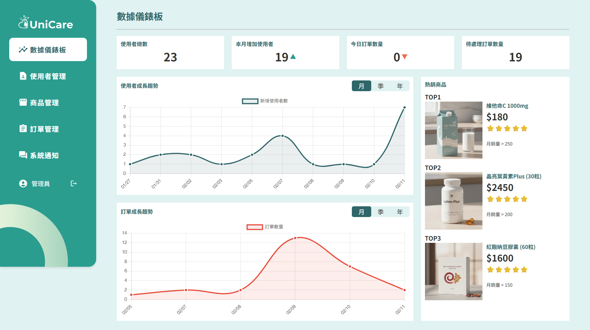
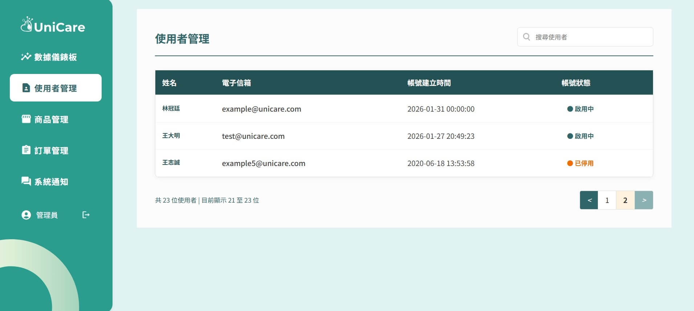
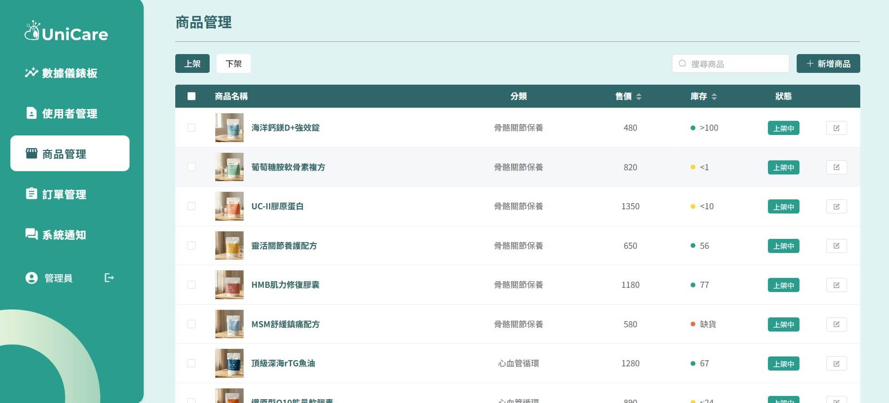
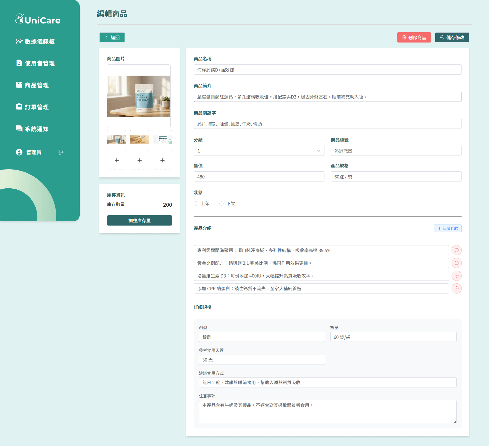
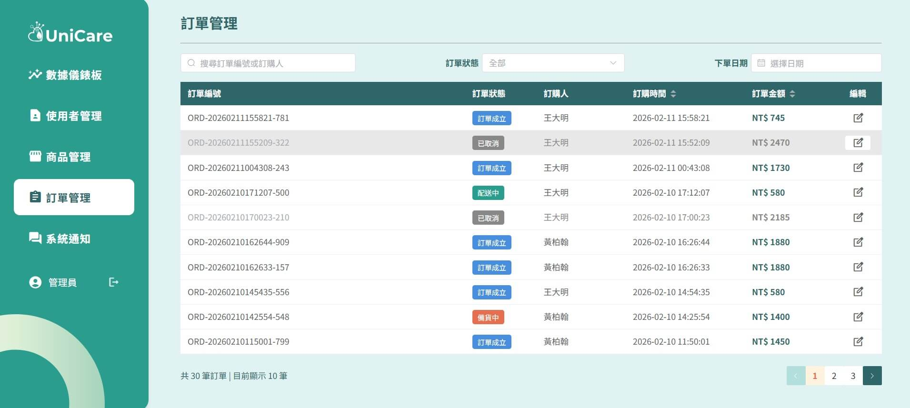
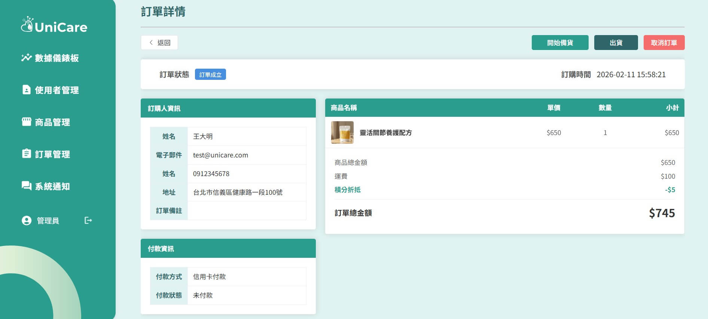
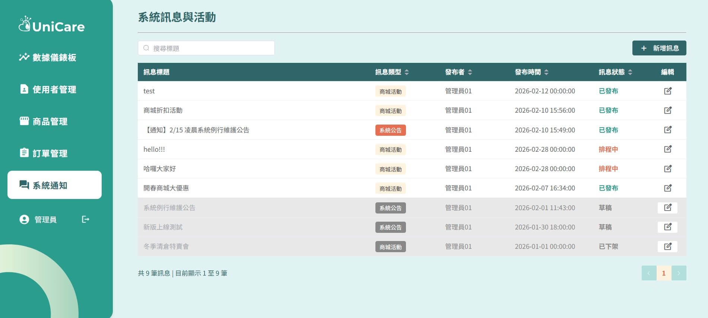
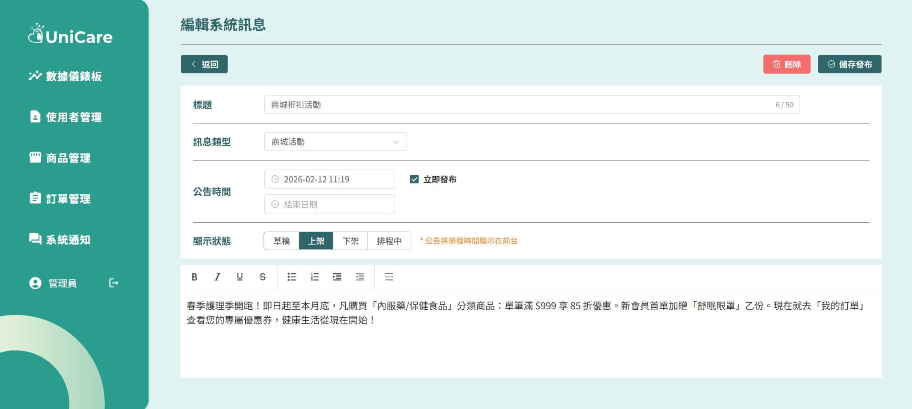

# UniCare 健康數據中控台


 

> **遠端守護，聯合照顧** —— 結合醫療保健產品與長者慢性身體數據紀錄的全方位照護平台。

## 專案簡介

**UniCare** 是一套專為解決現代子女因工作忙碌、無法時刻陪伴長輩痛點所設計的系統。我們致力於改善傳統紙筆記錄易丟失、介面複雜無誘因等問題。

透過本平台，使用者可以進行全方位的數位健康數據管理。同時結合樂活商城，讓子女即便遠在他鄉，也能即時透過視覺化的圖表與通知，精準掌握家中長輩的健康狀況。

---

## 相關連結

* [專案正式上線網址](https://tibamef2e.com/cjd102/g1/)
* [專案 Demo 影片](https://www.google.com/search?q=https://youtube.com/...)
* [系統分析文件](https://drive.google.com/file/d/1AA18ODrwgjLmlsjEHNaUZL2IwZqd6rO-/view)
* [Figma連結](https://www.figma.com/design/X78x31tK2e6S5C17o5cA0N/%E5%9C%98%E9%AB%94%E5%B0%88%E9%A1%8C%E8%A8%AD%E8%A8%88%E6%AD%A3%E5%BC%8F-%E5%A4%9A%E9%A0%81%E9%9D%A2-?node-id=0-4&t=FtUkNAqiQ6REpRAA-1)

---

## 技術架構

### 後端 & 其他
| 類別 | 技術/工具 |
| :--- | :--- |
| **後端語言** |  |
| **資料庫** |  |
| **協作工具** | Git, SourceTree, Figma |

---

## 專案功能


### 後台功能 (管理端)

| 管理模組 | 功能亮點 |
| :--- | :--- |
| **儀表板** | 數據總覽 (使用者增長、營收)、圖表切換 (月/季/年)、熱銷排行。 |
| **使用者管理** | 管理使用者帳號狀態。 |
| **商品管理** | 商品上下架、庫存調整、商品介紹調整。 |
| **訂單管理** | 訂單狀態變更 (連動前台通知)、出貨管理、條件篩選。 |
| **系統管理** | 公告與優惠活動發布、權限控管。 |

---

## 後臺介面展示
### 數據儀錶板
 
### 使用者管理
 
### 商品管理
 
### 商品管理
 
### 商品管理
 
### 訂單詳情
 
### 系統訊息與活動
 
### 編輯系統訊息
 
---

## 專案架構

| 資料夾 | 說明 | GitHub連結 |
| :--- | :--- | :--- |
| `front/` | 前台內容 | [前台](https://github.com/jc-1001/251228_team_project/tree/dev) |
| `admin/` | 後台內容 | [後台](https://github.com/jc-1001/260110-backstage/tree/dev) |
| `api/` | PHP內容 | [API](https://github.com/jc-1001/260128-api/tree/dev) |

---

## 團隊成員

| 成員 | 負責領域 | 詳細職責 | GitHub |
| :--- | :--- | :--- | :---: |
| **游佳純** | 前台 / 後台 / 文件 | Layout 切版、Banner、快速紀錄、後台 Element Plus 導入、系統活動管理 | [@jc-1001](https://github.com/jc-1001) |
| **徐子益** | 前台 | 數位藥箱、服藥提醒、翻卡特效、庫存視覺化 | [@ziyi1114](https://github.com/ziyi1114-bot) |
| **羅方敏** | 前台 / 後台 | 登入註冊系統、幫助中心、個人資料、後台使用者管理 | [@neoLuo00c](https://github.com/neoLuo00c) |
| **劉岳霖** | 前台 | 飲食日記、行事曆整合 (Day.js) | [@yuelinnnnn](https://github.com/yuelinnnnn) |
| **李妮** | 前台 / 後台 / 金流 | 商城系統、購物車、LINE Pay 串接、訂單管理、商品管理、積分管理 | [@NLeeii](https://github.com/NLeeii) |
| **黃煜軒** | 前台 / 後台 | 身體數值中心 (Chart.js)、後台儀表板數據統計 | [@bruce3721180](https://github.com/bruce3721180) |

---

## 如何開始

1. **環境需求**： Node.js (v16+), npm 或 yarn。
2. **安裝依賴**：

```bash
# Clone 專案
git clone [您的專案網址]

# 進入資料夾並安裝
cd unicare-project
npm install

```

3. **啟動專案**：

```bash
npm run dev

```

請前往 `http://localhost:5173` 查看運行結果。

---

© 2026 UniCare Team. All Rights Reserved.